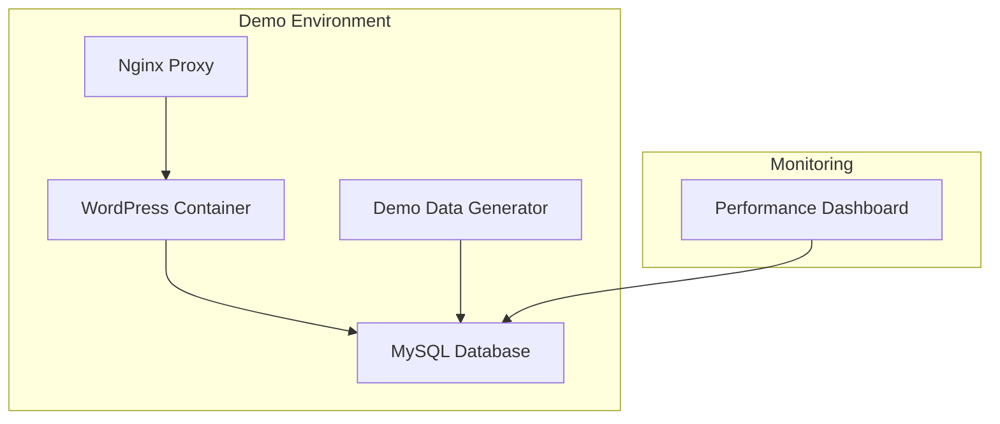

# Design Document

## Overview

The demo WordPress database environment will be implemented as a separate Docker Compose configuration that creates a complete, isolated WordPress ecosystem. This environment will include a MySQL database pre-populated with realistic demo data, a WordPress installation with demo plugins and themes, and an Nginx reverse proxy for better performance simulation. The design focuses on creating authentic performance scenarios that showcase the dashboard's monitoring capabilities.

## Architecture

### Container Architecture



### Service Components

1. **MySQL Database Container**
   - MySQL 8.0 with performance schema enabled
   - Pre-configured with demo database and performance monitoring tables
   - Includes slow query log and general query log enabled
   - Custom configuration for performance monitoring

2. **WordPress Container**
   - WordPress latest with pre-installed demo plugins
   - Custom themes for varied performance characteristics
   - Demo content including posts, pages, media, and users
   - Performance-impacting plugins for realistic scenarios

3. **Nginx Proxy Container**
   - Nginx reverse proxy for caching and performance simulation
   - Custom configuration to simulate real-world scenarios
   - Access logging for performance analysis

4. **Demo Data Generator Container**
   - One-time initialization container
   - Populates database with realistic performance data
   - Creates varied query patterns and response times
   - Generates admin-ajax call logs

## Components and Interfaces

### Docker Compose Configuration

**File:** `docker-compose.demo.yml`

Services configuration:
- `demo-nginx`: Nginx proxy (port 8090)
- `demo-wordpress`: WordPress application (internal port 80)
- `demo-mysql`: MySQL database (port 3307 to avoid conflicts)
- `demo-data-generator`: Initialization container

### Database Schema Extensions

**Performance Monitoring Tables:**
- `wp_performance_logs`: Query execution times and patterns
- `wp_slow_queries`: Slow query log data
- `wp_plugin_performance`: Plugin-specific performance metrics
- `wp_ajax_calls`: Admin-ajax call tracking

### Demo Data Structure

**WordPress Content:**
- 50+ demo posts with varied content lengths
- 10+ pages including complex page builders
- Media library with 20+ images
- 5 user accounts with different roles
- Comments and metadata for realistic database load

**Plugin Configuration:**
- WooCommerce with sample products (performance-heavy)
- Contact Form 7 with multiple forms
- Yoast SEO with full configuration
- Custom performance-testing plugin for controlled load
- Caching plugin (disabled for demo purposes)

## Data Models

### Performance Log Entry
```javascript
{
  id: integer,
  timestamp: datetime,
  query_type: string,
  execution_time: float,
  query_hash: string,
  affected_rows: integer,
  plugin_context: string
}
```

### Plugin Performance Metric
```javascript
{
  plugin_name: string,
  hook_name: string,
  execution_time: float,
  memory_usage: integer,
  call_count: integer,
  timestamp: datetime
}
```

### Ajax Call Log
```javascript
{
  action: string,
  execution_time: float,
  response_size: integer,
  user_id: integer,
  timestamp: datetime,
  success: boolean
}
```

## Error Handling

### Container Startup
- Health checks for all services with appropriate timeouts
- Dependency ordering to ensure MySQL is ready before WordPress
- Retry logic for database connections
- Graceful degradation if demo data generation fails

### Data Generation
- Validation of demo data integrity
- Rollback capability if data generation fails
- Progress logging for troubleshooting
- Idempotent operations for safe re-runs

### Service Communication
- Connection pooling for database access
- Timeout configurations for all inter-service communication
- Error logging with structured format
- Monitoring endpoints for service health

## Testing Strategy

### Integration Testing
- Verify all containers start successfully
- Test database connectivity and demo data presence
- Validate WordPress functionality with demo content
- Confirm performance dashboard can connect and display data

### Performance Testing
- Measure container startup times
- Verify demo data generation performance
- Test resource usage under load
- Validate realistic performance metrics generation

### Demo Validation
- Automated checks for demo content completeness
- Performance metric validation
- WordPress admin functionality testing
- Frontend rendering verification

### Environment Testing
- Port conflict detection and resolution
- Volume persistence testing
- Network isolation verification
- Clean shutdown and restart testing

## Implementation Notes

### File Structure
```
/demo/
├── docker-compose.demo.yml
├── nginx/
│   └── nginx.conf
├── mysql/
│   ├── init.sql
│   └── my.cnf
├── wordpress/
│   ├── wp-config-demo.php
│   └── demo-plugins/
└── scripts/
    ├── generate-demo-data.js
    └── setup-demo.sh
```

### Configuration Management
- Environment variables for customizable demo parameters
- Separate configuration files for each service
- Version-controlled demo data seeds
- Configurable performance scenario parameters

### Performance Scenarios
- Slow query simulation through complex WordPress queries
- Plugin performance variation through controlled execution delays
- Memory usage patterns through varied content sizes
- Cache miss scenarios for realistic performance metrics
